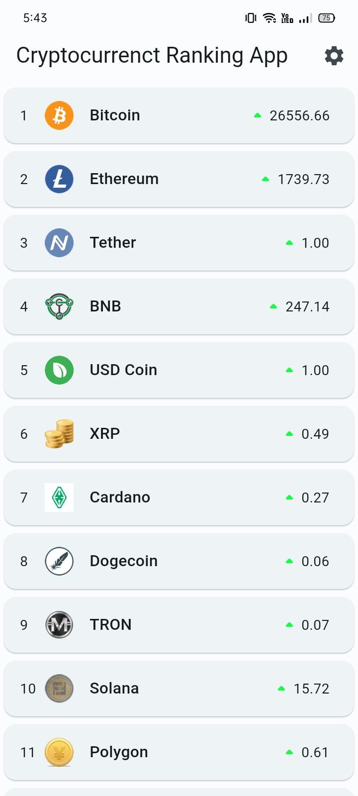
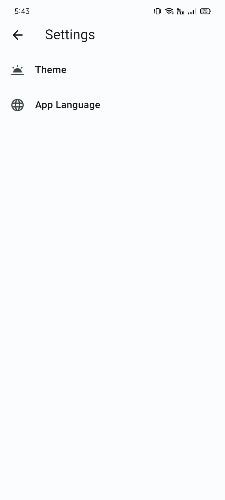
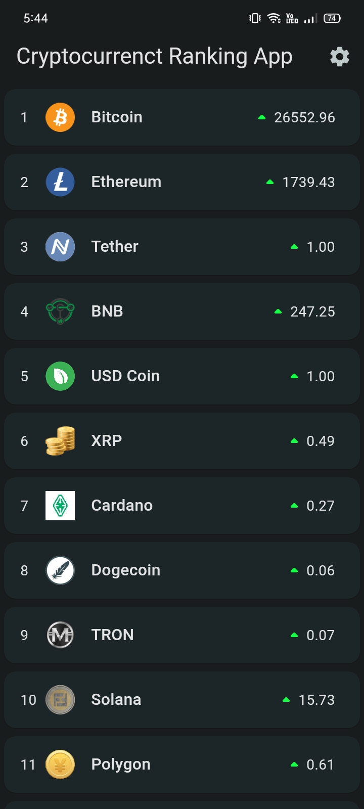
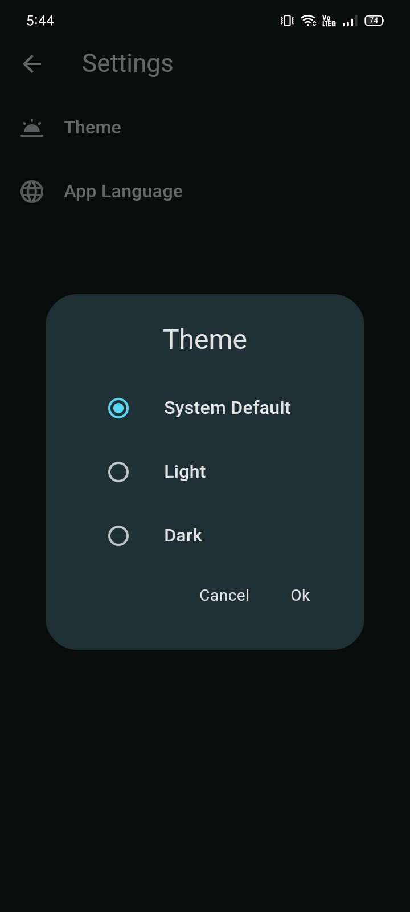

# Cryptocurrency Ranking App

This application ranking popular crypto coins using Coin Market Cap Api.

## Usage

Add your CoinMarketCap Api key to 'X-CMC_PRO_API_KEY' in lib/view/\_product/constants/api/api_constants.dart file line 9.

Architecture

- Mvvm, Mvc

State Management

- Cubit (bloc)

Service

- Http

Routing

- Go router

Animation

- Lottie

Splash Screen

- Flutter native splash

Onboarding

- Introduction screen

Localization

- Easy localization

App icon

- Flutter Launcher Icon

## Requirements

Flutter 3.7.11

Dart 2.19.6

Packages

Icons - cupertino_icons: ^1.0.2

Localization - easy_localization: ^3.0.1

State management - flutter_bloc: ^8.1.2

Navigation go_router: - ^6.5.7

Local storage caching - hive: ^2.2.3, hive_flutter: ^1.1.0

Service - http: ^0.13.5

Onboarding - introduction_screen: ^3.1.4

Animation - lottie: ^2.3.2

## Images

 

  
  
  
  
  
  
  
  

 

 

  
  
  
  
  
  
  
  

 

## Gif

  

