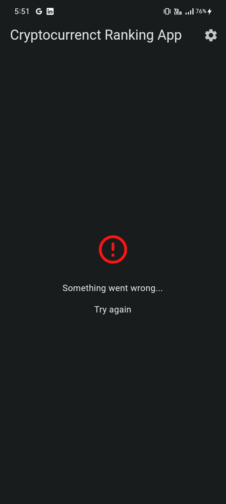
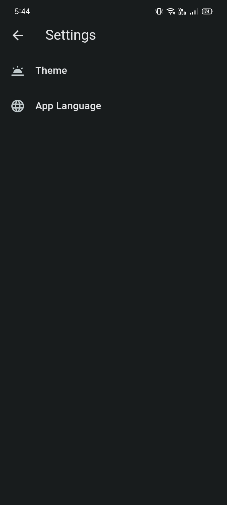
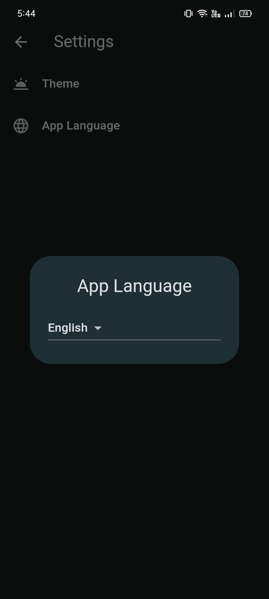

# Cryptocurrency Ranking App

This application ranking popular crypto coins using Coin Market Cap Api built Flutter.

  

## Usage

Create .env file in home directory. Define the coinmarketCap key so that the key value is `COIN_MARKET_CAP_API_KEY`.

### Architecture

- Mvvm

### State Management

- Cubit (bloc)

## Requirements

Flutter `3.10.4`

Dart `3.0.3`

### Dependencies

State management - `flutter_bloc: ^8.1.2`

Dependency Injection - `get_it: ^7.6.0`

Json Code Generation - `json_serializable: ^6.7.0, json_annotation: ^4.8.1`

Object Equality - `equatable: ^2.0.5`

Enviroment Values - `flutter_dotenv: ^5.1.0`

Service - `http: ^0.13.5, dio: ^5.1.2`

Routing `go_router: - ^6.5.7`

Caching - `hive: ^2.2.3`, `hive_flutter: ^1.1.0`

Localization - `easy_localization: ^3.0.1`

Onboarding - `introduction_screen: ^3.1.4`

Animation - `lottie: ^2.3.2`

Icons - `cupertino_icons: ^1.0.2`

### Developer Dependencies

Splash Screen - `flutter_native_splash: ^2.2.19`

Linter - `very_good_analysis: ^4.0.0, flutter_lints: ^2.0.0`

App Icon - `flutter_launcher_icons: ^0.13.0`

Caching Code Generator - `hive_generator: ^2.0.0`

Runner - `build_runner: ^2.3.3`

## Images

### Light Theme

 

  
  
  
  
  
  
  
  
  

 

### Dark Theme

 

  
  
  
  
  
  
  
  
  

 
